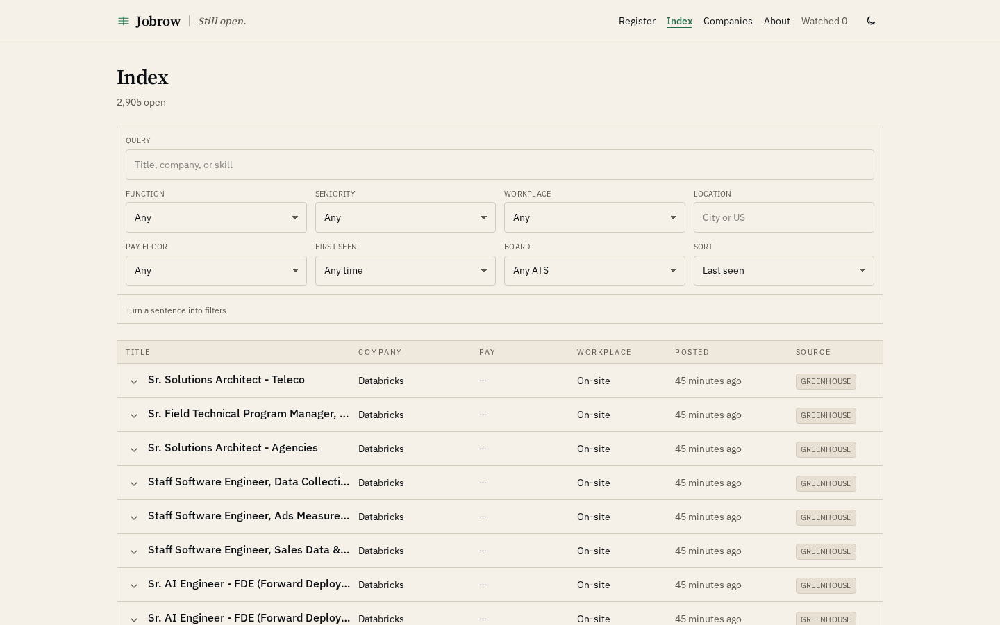
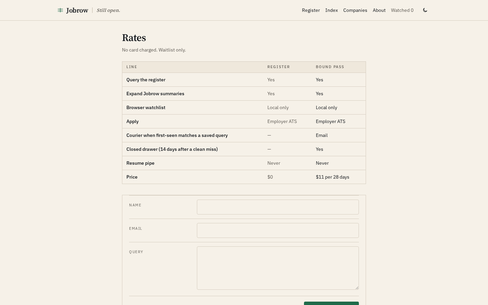

# Jobrow

Public register of **still-open US tech roles**, read from employer ATS JSON — not from another job site.

Tagline: **Still open.**

[](https://job-board-devtechedge1.vercel.app)
[](https://job-board-devtechedge1.vercel.app/companies)
[](https://tanstack.com/start)
[](https://www.typescriptlang.org/)
[](LICENSE)

---

## Live demo

**https://job-board-devtechedge1.vercel.app**

Production is **Neon Postgres** on Vercel Hobby. The index currently holds **2,000+ open US tech roles across 34 boards**. Apply always leaves Jobrow for the employer ATS. Independent index — not an employer, recruiter, or agency.

`GET /api/health` reports `{ db: "neon", openJobs, pendingBoards }`.

---

## Screenshots

| Register | Index |
|----------|--------|
|  |  |

| Role | Companies |
|------|-----------|
|  |  |

| About | Rates |
|-------|--------|
|  |  |

Share card: [docs/screenshots/social-preview.png](docs/screenshots/social-preview.png)

---

## What you can do

- **Register** (`/`) — date, open count, filters, latest rows, functions, boards
- **Index** (`/jobs`) — full paginated table of the US tech slice
- **Companies** (`/companies`) — 34 boards, US-tech count vs listed count, last successful fetch
- **Role** (`/jobs/:id`) — summary, pay, workplace, posting HTML, Apply (leaves the site)
- **Desk** (`/contact`) — corrections and legal notes (not applications)
- **Add a board** (`/employers`) — public Greenhouse / Ashby / Lever / Workable token
- **Rates** (`/pricing`) — Bound pass waitlist (`$11` / 28 days). No live checkout
- **Placements** (`/placements`) — Ruled pin `$120` / masthead line `$55`. Waitlist only
- **Watchlist** — local to the browser. No account. No resume upload
- **Admin** (`/admin`) — password-gated crawl and board edits

A role **drops when a successful crawl no longer sees it**. A failed fetch does not close that board.

---

## Registry (34)

Seeded from [data/companies.csv](data/companies.csv) and [src/lib/seed-companies.ts](src/lib/seed-companies.ts). Tokens were confirmed against live public board JSON.

| ATS | Companies |
|-----|-----------|
| Greenhouse (24) | Stripe, Anthropic, Airbnb, Coinbase, Discord, Figma, Cloudflare, Databricks, Vercel, Dropbox, Robinhood, Block, Lyft, Pinterest, Reddit, Twilio, Datadog, MongoDB, Instacart, Roblox, GitLab, Grafana Labs, Asana, Okta |
| Ashby (7) | OpenAI, Ramp, Linear, Notion, Cursor, Perplexity, Supabase |
| Lever (3) | Palantir, Wealthfront, Spotify |

US-eligible **tech** titles stay on the register. Sales, finance, and non-US postings on the same board are ignored. The companies table shows both **US tech** and **listed** (raw JSON rows on the last good fetch).

### Add another company

1. Confirm the public board JSON exists:
   - Greenhouse: `https://boards-api.greenhouse.io/v1/boards/{token}/jobs`
   - Ashby: `https://api.ashbyhq.com/posting-api/job-board/{token}?includeCompensation=true`
   - Lever: `https://api.lever.co/v0/postings/{token}?mode=json`
2. `/admin` → unlock with `ADMIN_PASSWORD` → name / slug / ATS / board token / careers URL → crawl that row.
3. Or append a line to `data/companies.csv` and a matching object in `SEED_COMPANIES`.

Do not scrape career marketing HTML when the board JSON exists. Do not scrape other job aggregators.

---

## Stack

| Layer | Technology |
|-------|------------|
| App | TanStack Start, React 19, TypeScript, Tailwind v4 |
| Data | Neon Postgres in production; embedded PGLite when `DATABASE_URL` is omitted (local) |
| Sources | Greenhouse, Ashby, Lever public JSON (Workable adapter ready) |
| Host | Vercel Hobby |
| Crawl | GitHub Action, twice daily, `POST /api/cron/crawl` with `Authorization: Bearer` |
| Security | CSP and related headers in [vercel.json](vercel.json); see [SECURITY.md](SECURITY.md) |

---

## Quick start

```bash
npm install
npm run dev
```

Without `DATABASE_URL` the app uses embedded PGLite and seeds the 34 boards on first load.

```bash
npm test
npm run typecheck
```

Env template: [.env.example](.env.example). Never commit secrets.

| Variable | Where | Purpose |
|----------|--------|---------|
| `DATABASE_URL` | Vercel | Neon pooled URI (`sslmode=require`) |
| `ADMIN_PASSWORD` | Vercel | `/admin` |
| `CRON_SECRET` | Vercel + GitHub Actions | Cron bearer token |
| `APP_URL` | GitHub Actions | Origin the Action calls |
| `VITE_SITE_URL` | Vercel | Sitemap / JSON-LD origin |

Production already has Neon attached. Local demos can omit `DATABASE_URL`.

---

## Security

See [SECURITY.md](SECURITY.md). Report vulnerabilities with GitHub private advisory, not a public issue.

Hardening in this tree: parameterized SQL, escaped job HTML, script-safe JSON-LD, password-gated admin dump, ATS host allowlist, no `?secret=` on cron, desk size cap, public-https URL checks.

---

## Remaining

| Item | Status |
|------|--------|
| Custom domain / final brand | Working name is Jobrow. Buy later. |
| Neon | Live. |
| GitHub Action `APP_URL` + `CRON_SECRET` | Set on the repo. |
| Counsel | Terms / privacy / sourcing are drafts. |
| Bound pass / ruled pins | Rate card exists. Checkout is not live. |

---

## License

MIT. See [LICENSE](LICENSE).
