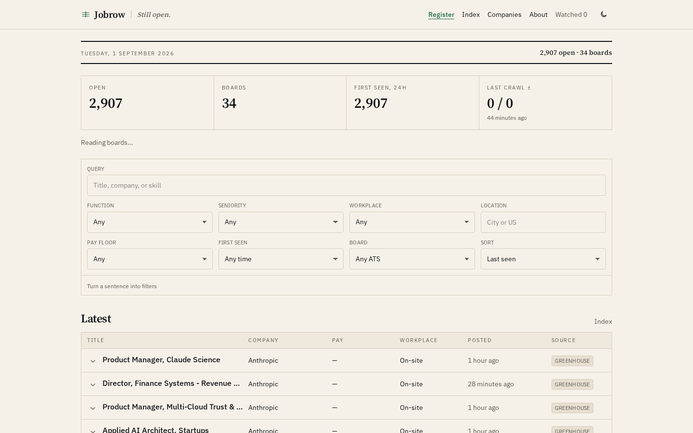
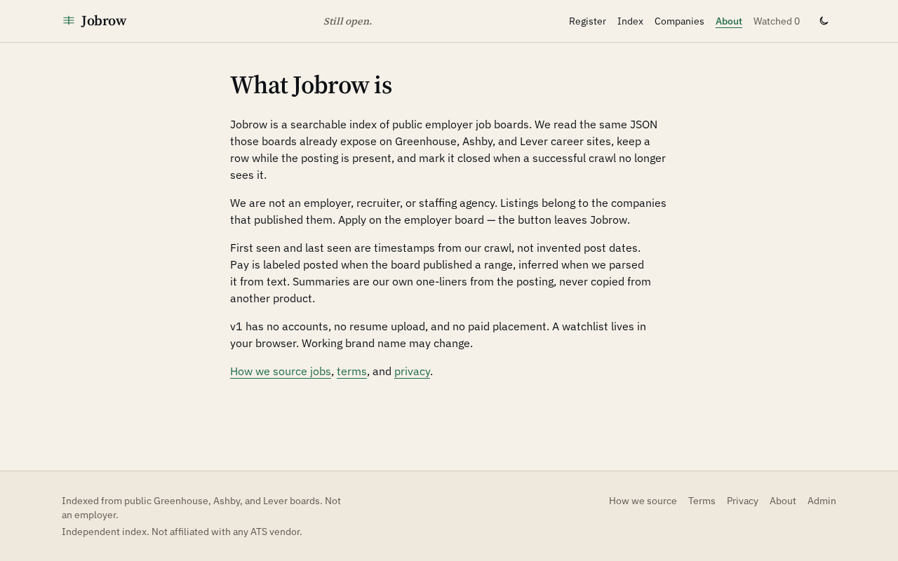
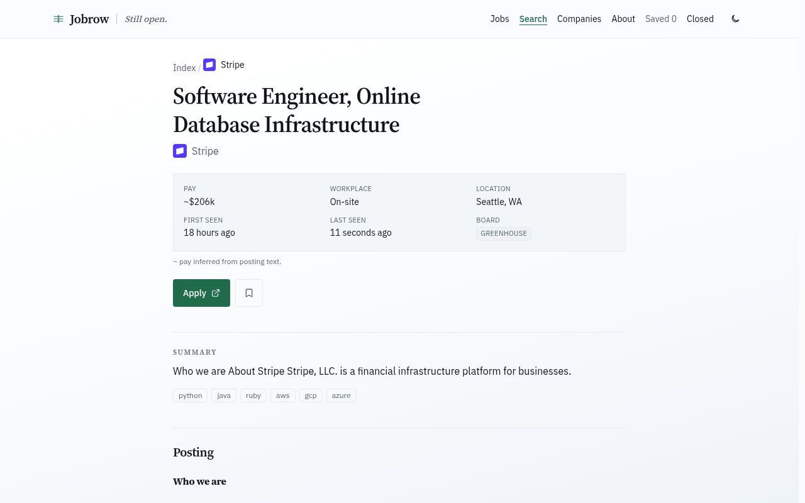
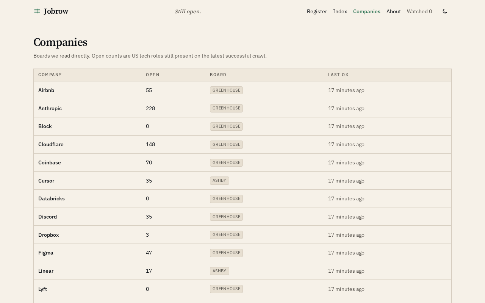

# Jobrow

Searchable register of still-open US tech roles, read from public employer ATS boards.

[](https://job-board-devtechedge1.vercel.app)
[](https://tanstack.com/start)
[](https://www.typescriptlang.org/)
[](LICENSE)

---

## Live Demo

**https://job-board-devtechedge1.vercel.app**

> **Status:** Public Vercel Hobby. No `DATABASE_URL` is set, so the index runs on embedded PGLite and reseeds from public Greenhouse / Ashby / Lever JSON on cold start. Apply always leaves the site for the employer board. Independent index — not an employer, recruiter, or agency.

---

## Screenshots

| Register | About |
|----------|--------|
|  |  |

| Role | Companies |
|------|-----------|
|  |  |

---

## Features

- Table-first register: title, company, pay, workplace, posted, source
- Structured filters plus a free-text box
- Same-run close when a successful board fetch no longer lists the role
- Company pages, original legal drafts, localStorage watchlist
- Admin password to add a board token and trigger a crawl
- Twice-daily crawl Action hitting `POST /api/cron/crawl` (needs `APP_URL` + `CRON_SECRET`)

---

## Tech Stack

| Layer | Technology |
|-------|------------|
| App | TanStack Start, React 19, TypeScript, Tailwind v4 |
| Data | Postgres. Neon when `DATABASE_URL` is set; embedded PGLite on the public Vercel demo |
| Sources | Greenhouse, Ashby, Lever public JSON APIs |
| Hosting | Vercel |
| Crawl | GitHub Action, twice daily |

---

## Quick Start

```bash
npm install
npm run dev
```

Optional env: see [.env.example](.env.example).

Add a board in `/admin` (password from `ADMIN_PASSWORD`, or `jobrow-preview` in the sandbox).

---

## License

MIT. See [LICENSE](LICENSE).
